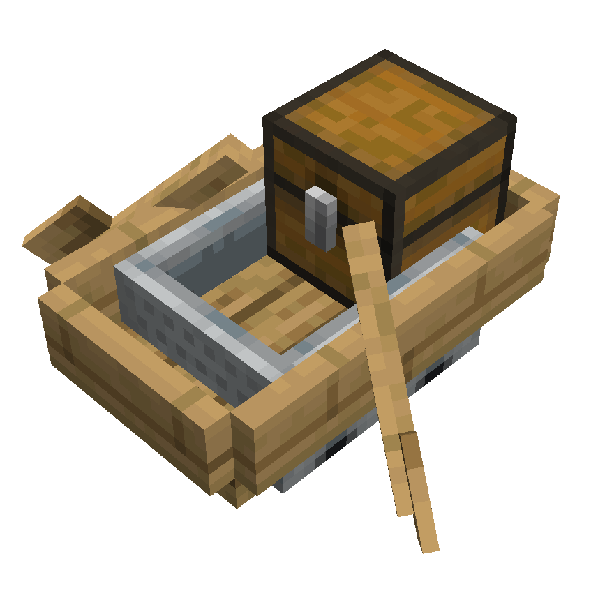

# Chest-Boat in Minecart Package

  

## Description

This contraption consists of a chest boat riding a minecart. It works almost the same as a regular chest minecart, but with one key difference: entities and players can ride inside it. This means any riding entity counts as extra payload, in addition to the chest on the boat. Networks that support this setup can carry resources like a normal Resource Distribution System (RDS) and transport mobs/players at the same time, doubling as both standard RDS and player automatic transportation network.

Effectively acting like a chest minecart, this technology fully support the [**Standard RDS Protocol**](/docs/rds/rds_protocols.md#the-standard-rds-protocol), and can therefore be used in RDS-compliant networks.

## Notes

Using this technology, it's possible to set up an entire RDS network  that is dedicated solely to player transportation (more like a Player-Transportation-System, **PTS**). Note that in such a network, chunkloaders would not be necessary, as players can successfully keep all sourrounding chunks loaded by moving along with the Package during the journey. This is already being done in the [*NETro by JazzyRed*](https://www.youtube.com/watch?v=nSqEuU0z6X0), which works in a very similar way to a RDS network.

Note that, although *very similar* to a Chest-Minecart, this technology **does** behave in slightly different ways in some circumstances, so it may not be compatible with ChestMinecarts-based designs straightaway. Some known differences are:

- Directional Repulsion/Propulsion forces appear when a player is riding inside the boat. This might cause unexpected behaviour on unpowered rail segments or during freefalls.
- Comparators connected to detector rails cannot detect the content of the chest boat, and will always output a null signal.
- Slighly different (larger) hitbox.

In conclusion, this technology could have great use cases, especially in networks that already support [Chest-Minecarts](/implementations/Packages/ChestMinecart/specs.md). Because Chest-Boat-Minecarts are largely similar to Chest-Minecarts, designing cross-compatible Routers, Terminals and Links is much easier. Networks using such designs can support both technologies at once, where some packages travel in Chest-Minecarts while others carry players in Chest-Boat-Minecarts, effectively letting the same RDS network function as both automatic Resource Distribution and automatic Player Transportation.