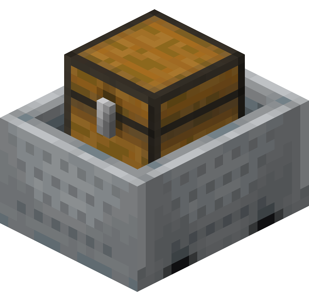

# Chest Minecart Package

  

## Description

Usage of a chest minecart as a Package is pretty straightforward. The Package is the cart itself, this means that the cart is created in a Terminal, is moved and routed around by Links and Routers (moving mainly on rails, but not necessarily), and eventually stops at a destination Terminal. Ideally, the cart is never destroyed during its journey as a Package. 

The chest minecart Package technology fully support the [**Standard RDS Protocol**](/docs/rds_protocols.md#the-standard-rds-protocol), and can therefore be used in RDS-compliant networks.

## Notes
This technology could be very useful if a Shulker-Box farm is not available or if the network is small enough that the added entity processing overhead to the server is negligible.  

