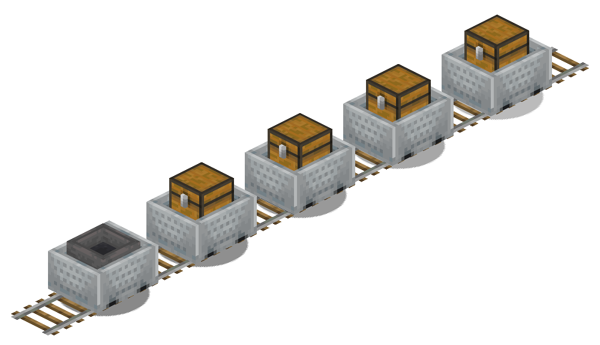

# Minecart Convoy Package

  

## Description

In this Package technology, the Package consists of multiple carts (mainly, ChestCarts and Minecarts with hopper) that all travel together on the same railway one after another (or in a cluster, as discussed [here](#clusters-of-merged-minecarts)). The Package inventory is not one singular container, but the cumulative inventory of all the wagons combined. The convoy may start with a hopper minecart, which contains the Address Stamp/s; this is to simplify the design of multi-item sorters inside Routers. The ending cart is simply the one after which no more carts pass within a suffiently long time window.

This Package technology also allows for rideable carts to be part of the convoy, meaning that this Package also allows transportation of Players/Entities.

Considering that the Package inventory can be simply thought of as the cumulative inventory of the whole convoy, this technology supports the [**Standard RDS Protocol**](/docs/rds/rds_protocols.md#the-standard-rds-protocol).

## Notes
Although theoretically unlimited in size, a large number of wagons increase the physical length of the Package, and this can significantly increase the complexity of networks using this technology. For these reasons, the maximum capacity of this Package has been conventionally fixed to 248 slots, that is 10 carts in total (1 Hopper Minecart + 9 Chest Minecarts), but this is not a hard limit, just an advice.

For this technology, terminals play a major role in injecting an ordered and *(possibly)* evenly spaced sequence of carts into the railway network, and also in safely disposing of an arriving minecart convoy.

For long convoys, it can be difficult to build merging sections that funnel multiple rail lines into a single rail while preserving the order of carts and not accidentally mixing carts from one convoy with ones from another (this could be required by some router designs that only have one physical input port, and hence require all input Link channels to be funneled into a single input channel) 

#### Clusters of merged Minecarts
Note that it is also be possible to compress the physical size of the minecart convoy by stacking the Payload wagons in a single "cluster" of carts, instead of sending a spaced sequence of them. This can drastically reduce the physical length of the Package, occupying effectively the space of just two carts: one for the "locomotive" (the cart carrying the Address Stamp/s) and one for the Payload (cluster of chest carts carrying items).  
Also note that, for clusters of 3+ minecarts, powered propulsion is no longer necessary and travel can also occur without rails. This greatly simplifies the design and build cost of Links. More details on the [Wiki](https://minecraft.wiki/w/Minecart#Merged_minecarts).

>This mechanic of moving "clusters" of carts has already successfully been used in *Wavetech's Pistonbolt Network* (see an explanatory video [*here*](https://www.youtube.com/watch?v=Dscgmgqg59E&t=138s))

