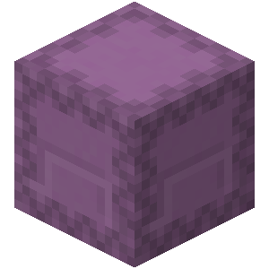

# Shulker Box Package

  

## Description

A Shulker‑Box is the only container in Minecraft that can be broken and carried as an item while keeping all its contents inside. This property makes it an ideal candiadate for a RDS Package. 
Any RDS component supporting this technology must implement ways of handling Shulker‑Boxes and their contents, which generally requires ways of placing them down and breaking them automatically inside Routers in order to examine the Address Stamp.

The Shulker‑Box Package technology fully supports the [**Standard RDS Protocol**](/docs/rds_protocols.md#the-standard-rds-protocol), and can therefore be used in RDS-compliant networks.

## Notes
Due to the Shulker-Box capability to be transported as any other item, this solution is probably the most versatile in the whole Game. This means that it can work well with a very wide range of different RDS implementations of mainly Routers, Terminals and Links, and easily allows mixed implementations to coexist in the same network.

Shulker-Boxes are probably the best choice for more serious high-performant networks, although they inevitably bring more cost and complexity compared to other techologies such as [Chest-Minecarts](/implementations/Packages/ChestMinecart/specs.md).