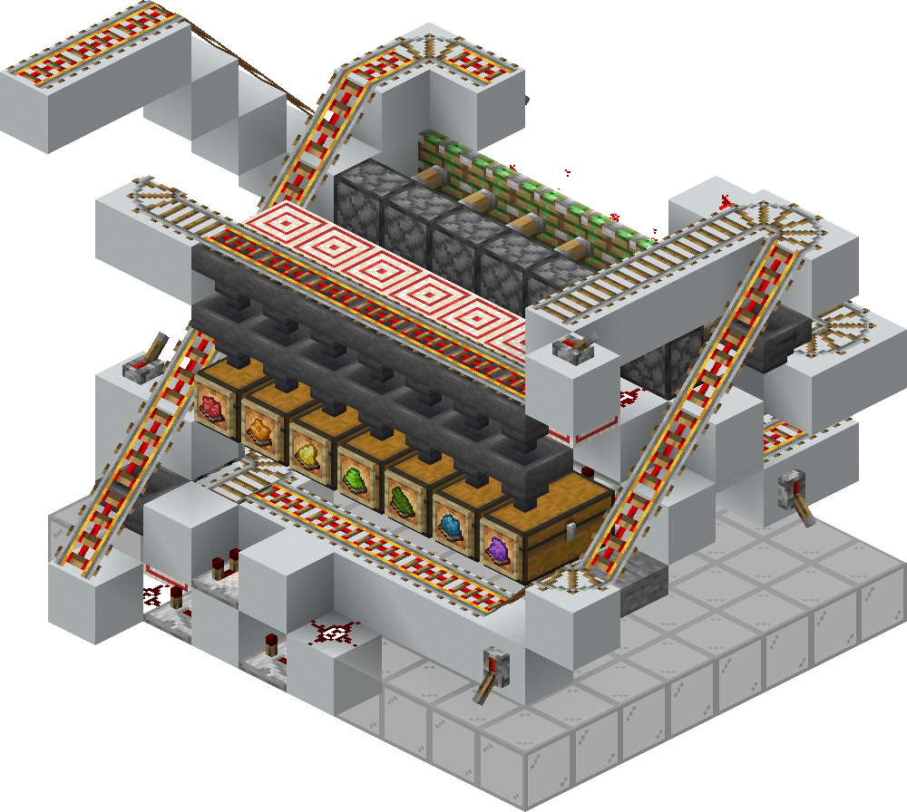

<!-- Insert here the name of your Router -->
# Easy Cart Router

  
  
<em>Back view of a 8-port Router CORE</em>

## Description

This router is a cheap and compact design for early-game or simple networks, based on chest minecarts and rails. The design has a tilable Output Port design,
meaning that the design can adapt to any amount of Output Ports. A router with 1 input, and 14 output ports (13 route-mapped ones, 1 default) perfectly fits within a minecraft Chunk (16x16 area).

---

## Specifications

> **Note**: *Physical* Input Ports refer to the amount of physical input Link connections the router has. The number of *Logical* ports for a Router is **1**, unless specified.

<!--
If the Router has more that one logical input port, for example, if it's capable of source-port-based routing (discussed in router_specs.md), add the following entry below the "Physical Ports (I/O)":
| Logical Ports (I/O)   | #in_p
>

<!-- 
Conventionally, N represents the number of ports for scalable designs that can be expanded to any number of ports.  
It can be used in formulas below (for example in footprint expression).
Uncomment the line below if your are using N.  
-->
> `N` represents the number of Output Ports. 

<!--
Package Technology must reference an existing specification file
located under implementations/Packages.

Do NOT write a free-text name only.
Always link to the corresponding spec file of the implementation.

If the technology you are using does not yet exist in
implementations/Packages, create and document the new Package
Technology there first, then reference it here.
-->

|  Specification   | Value |
|----------------------|-------|
| Design Version    | 1.0
| Minecraft Version     | Java 26.1
| Component Class       | [RDS Router](/docs/rds/router_specs.md) 
| Package Technology    | [ChestMinecart](/designs/RDS%20implementations/Packages/ChestMinecart/specs.md)
| Protocol              | [Standard RDS Protocol](/docs/rds/rds_protocols.md#the-standard-rds-protocol)
| Physical Ports (I/O)  | 1 / N
| Footprint (Area)      | 12×(2 + N) 
| Height                | 10
| Works in Nether       | Yes
| Chunkloading Included | Yes 
| Package Queue Included        | Yes
| Throughput            | ~9 Pkg/min (~6.6s/Pkg) **just an estimate*
| Survival-friendliness  | High

---

## Notes

#### Timing Circuit configuration

Although the design can support up to N ports, the Router must have a bare minimum of two ports:
- One default port (the direction minecarts are forwarded if no match is found in the routing table)
- One routable port (has a routing map associated)

This means that this Router will always occupy at least a 12x3 area if used in its minimal 2-ports form. Having less than these ports makes it effectively no longer a useful Router.

Also note that if the design were to exceed 14 ports, it would no longer fit inside a chunk. If you are building a router spanning multiple chunks, make sure to place a chunkloader wired in parallel to the default one for every chunk the router occupies.

---

As mentioned in the spec table, the router has a built-in minecart queue 
(taken from [CobblestoneAndDirt](https://www.youtube.com/watch?v=JQtGXKXlWMQ)), which works by stacking minecarts on top of each other and releasing them one by one, allowing Packages arriving close to each other to remain unstacked and be processed sequentially one at a time. The default queue size is 7, but it can be made bigger or lower by raising/lowering the ramp from which minecarts fall in.
The rail segment bringing minecarts up the hole can also be easily adapted based on specific needs.

---

The queue is controlled by a timer. Each time a minecart goes through, the queue locks and waits for a fixed preconfigured amount of time, before releasing the next minecart. This amount of time can be easily controlled by adding or removing items in the hopper-based timer. Generally, the amount of wait time grows linearily with the increase of output ports, meaning that 

---

Output Ports are return-safe, meaning that if something were to happen at the Link level causing minecarts to go back towards the Router from an output rail, they will be sent back out.
