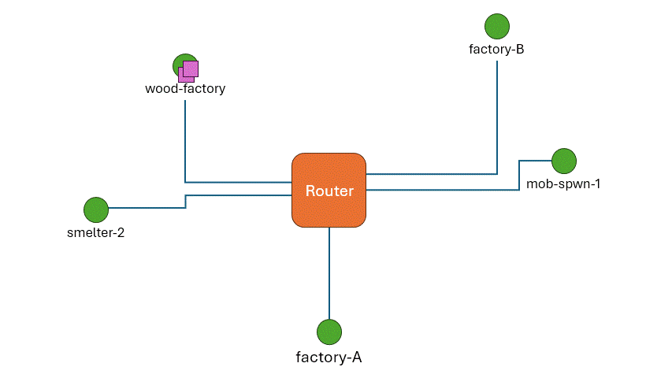

# The Resource Distribution System (RDS)

In the MC Industrial Web Framework, **factories** need to be able to exchange resources automatically, as well as deliver payload to remote locations of the world where resources might be needed. This can be done "easily" if there are only a few factories built close to each other, but starts becoming a harder problem as the number of factories that need to be connected grows and their physical separation increases.

In the **MIWF**, this is handled by the **Resource Distribution System (RDS)**, a layered system designed for automated and efficient point-to-point resource and entity transportation, inspired by the structure and behavior of real-world Internet networks. The goal of the RDS is to automate the delivery of a payload from a generic point A to point B in the world, based on an **Address Stamp** attached directly to the payload itself, which uniquely identifies a reachable destination in the network.

> The term *"factory"* referes to any minecraft construction that allows the automated production of one or more resources (items, blocks, xp or entities). In most cases, *factories* are also more commonly reffered to as *farms* (e.g. chicken farm, sugar cane farm, iron farm, etc.)

## Core Entities of the Resource Distribution System (RDS)  

### 📦 Package

A **Package** is the fundamental unit of transport within an RDS network. It is a movable container that preserves its internal inventory while being transported through the world. In the RDS, Packages are the only entities that physically travel across the network. Any Minecraft container that satisfies this behavior can serve as a valid Package technology, but the chosen technology directly influences, and often constrains, the possible implementations of the other RDS entities (Routers, Terminals, and Links). All devices in a RDS network must therefore be compatible with the selected Package technology.

In the [Standard RDS Protocol](rds_protocols.md), the first slot non-empty slot of the Package inventory is reserved for the **Address Stamp**. The Address Stamp is *usually* a renamed item encoding the unique identifier of a Terminal. Routers use the Address Stamp to correctly forward the Package to its intended destination Terminal. All remaining slots after the Address Stamp of the Package are used for payload, and can be filled with anything.  

> NOTE: In circumstances where there is request-response pattern at play, it makes sense to talk about a **Destination Address Stamp** (**DAS**) and a **Return Address Stamp** (**RAS**); respectively, the Address Stamp of the *Responder* and that of the *Requester*.

Here are some examples of possible Package technology:
- [Shulker-Box](/designs/RDS%20implementations/Packages/ShulkerBox/specs.md) : highly versatile, as it can be stored and moved around like any other item.
- [Minecart with Chest](/designs/RDS%20implementations//Packages/ChestMinecart/specs.md) : Not as versatile as the above, but very cheap and simple to get working when Shulker-Boxes are not an option.

>More details can be found in the *[Package Specifications](package_specs.md)* file.

### 📬 Terminal  

A **Terminal** is an endpoint of the Resource Distribution System (RDS). It is a location where Packages can either enter or exit the network. Packages must be constructed based on the technology and protocol adopted by the network.

>More details can be found in the *[Terminal Specifications](terminal_specs.md)* file.

### 🔀 Router  

A **Router** is a core element of the RDS. It is directly inspired by Internet routers and follows the same operational principles.  

A Router is a node in the network where multiple edges meet and where traveling Packages are redirected based on their attached Address Stamp. By default, a RDS Router has exactly **one Input Port**, where all incoming Packages enter.

A Router can have any number of **Output Ports**. Each output port is simply an "exit gate", where Packages can leave the router in a specific direction. Every Output Port is bound to exactly one outgoing direction, and the Router's routing logic selects which port to use based on the Package's attached Address Stamp. Depending on the chosen Package technology, Output Ports may also function as temporary buffers where Packages wait before being collected and forwarded by the respective **Link**.

To perform routing decisions, a Router stores a **Routing Table** that maps each known destination address to a specific Output Port. When a Package arrives:  

1. The Router extracts the Address Stamp from the first slot of the Package.  
2. The Routing Table is checked for a matching destination address.  
3. The Address Stamp is reinserted into the same slot.  
4. If a matching output port exists, the Package is moved to that port.  

If no mapping is found, the behavior may vary (for example: forwarding to a fallback port or storing the Package for manual inspection).  

It is important to clarify that **Routers do not perform physical transportation**. They only move Packages from the Input Port to one of the Output Ports, based on their attached Address Stamp. The physical movement of packages is handled entirely by **Links**.  

Although conceptually different, a Router and a Terminal might physically coexist in the same structure. A single build may act as both a Router and a Terminal simultaneously.  

>More details can be found in the *[Router Specifications](router_specs.md)* file.

### 🚚 Link

A **Link** is the entity that "links" Routers and Terminals between each other. It consists of any Minecraft technology capable of moving Packages from one point to another, and is therefore highly coupled to the adopted Package implementation.

Within the RDS, a Link is responsible for physically moving Packages between:  

- Terminal → Router  
- Router → Router  
- Router → Terminal  

Each of these movements is called a **Hop**. A complete route from source Terminal to destination Terminal consists of multiple Hops, each performed by different Links.

Several Minecraft technologies can fulfill this role, each with advantages and disadvantages. The choice depends on the specific design requirements. Some basic examples include:  

- Flowing water conveyor systems  
- Minecart with Chest on rails  

Since Routers and Terminals are link-agnostic, different link technologies can be combined across different Hops of the same route, depending on constrains or conveniences dictated by enviromental or external factors. 

>More details can be found in the *[Link Specifications](link_specs.md)* file.

## Example: A Package Journey Through the RDS  

Suppose we want to transfer a large quantity of oak logs from the Oak Farm to the Industrial Smelter.  

1. A Destination Address Stamp (DAS) is created by renaming an item with the unique identifier of the Industrial Smelter (for example: `"smelter-2"`).  
2. The DAS is placed in the first slot of a Package (e.g. ShulkerBox)
3. The remaining slots are filled with oak logs.  

Once prepared, the Package is handed to the origin Terminal. The Terminal passes it to the Link, which moves it to the nearest Router.  

At the Router:  

- The Package enters from the Input Port.  
- It may be queued in a buffer if other Packages are already being processed. 
- The Router processes the DAS and forwards the Package to the correct Output Port.  

Once in the Output Port, it's now the job of the Link to perform the next Hop. Depending on the network structure, the Package may reach another Router (where the same process repeats) or directly reach the destination Terminal.  

Finally, when the Package arrives at `"smelter-2"`, the Link hands it to the destination Terminal, where the contents can be accessed by players or machines.  

  
  
<em>Visual representation of Packages traveling through a RDS network</em>

## Implementing full industrial automation using the RDS

We have seen how the RDS can dynamically move a Package full of resources from a generic point A to a point B in a Minecraft world. In theory, this system could already be used directly by players to assist with resource transportation. In practice, however, often there are faster manual methods for moving large quantities of items, such as Elytra flight with rockets.  

However, since the RDS is fully automatic, it can be used to interconnect any number of factories into a unified, fully automatic industrial network. Factories can exchange resources dynamically, even across very large distances. More importantly, the RDS provides a standardized, interconnected, web-like transportation infrastructure capable of satisfying all dependency relationships between factories.

For example, if Factory A and Factory B both depend on the output of Factory C, the RDS already enables items to flow from C to A and from C to B without requiring two separate, specialized transport lines. Similarly, if Factory C depends on the products of Factory E and Factory F, the same infrastructure naturally supports resource delivery from E and F back to C.  

It becomes clear how such an approach can support large-scale industrial automation projects.

### Service–Client Pattern

The Service–Client pattern applies whenever one entity provides a service and multiple clients may request it. In general terms, a client sends a request to a service provider, and the provider responds with the requested material or action.

Within the RDS context, for example, this pattern can be especially useful for factories that require periodic resource refills. Consider a Cake Factory. To continuously produce cakes, it must maintain internal storage for eggs, wheat, sugar, and milk. In an automated setup, whenever one of these resources drops below a certain threshold, the Cake Factory should be able to request a refill from the corresponding production farms (Egg Farm, Wheat Farm, and so on).

Using the RDS, this interaction can be implemented by exchanging two Packages:

- A **Request Package**, containing only information.
- A **Response Package**, containing the requested resources.

For a basic material request, the Request Package must include two essential pieces of information:

- **Source Address** – the address from which the request originates; in other words, where the response must be sent (typically the client’s own address).
- **Request Type** – the kind of action being requested.

These can be encoded as renamed items placed in the second and third slots of the Shulker Box (with the first slot reserved for the Destination Tag). The remaining slots are typically left empty for a Request Package.

On the service provider’s side, additional redstone logic is required to automatically parse the request, execute the appropriate action, construct a Response Package, and send it back to the specified Source Address. The exact technical implementation may vary, and could eventually be standardized, but strict standardization is not required as long as the provider respects the described protocol above.

Returning to the Cake Factory example:  
The Source Address could be stored as a ready-to-use Destination Tag named `"cake-fact"`, while the Request Type might be encoded as `"EGG-REFILL-qt10"` somehow indicating a refill request of 10 stacks of eggs. The Egg Farm, upon receiving this Request Package, prepares a Response Package containing the requested eggs and uses the provided `"cake-fact"` Destination Tag as the address used for the Response Package.

### ...Some more ideas:

#### Centralized Storage

Instead of having resources move directly between factories, a large centralized storage facility could be built — essentially a massive item sorter and warehouse. All produced resources would automatically be sent there through the RDS.  

In this model, factories would not contact individual production sites for refills. Instead, they would simply send requests to the central storage system, which would act as a universal provider. This approach could simplify dependency and centralizes inventory management.

#### Usage of the Nether

The entire RDS infrastructure could be constructed in the Nether. Because the Nether-to-Overworld distance ratio is 1:8, long-distance transportation becomes significantly faster in Overworld terms.  

However, it has to be noted that some Link tecnhologies might be unvaiablable in the nether, such as water conveyor systems. This also holds true for Routers that use flowing water or any other nether-incompatible technology.
