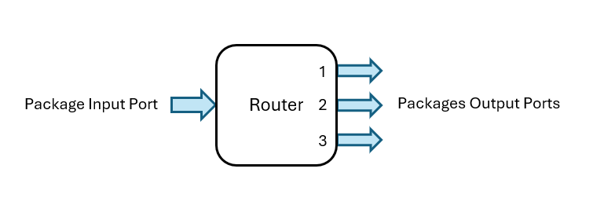

# RDS Router Specifications

This document defines exactly what an RDS Router is and how it operates in abstract terms. Every physical implementation of a Router MUST follow the requirements described here in order to function correctly inside an RDS network. Any machine that implements these specifications can be used as an RDS Router.

## What's a Router

If you don't know what a Router is, you can find a introductory explanation [*here*](/docs/overview.md#-router).

## Abstract Definition

### High-Level Diagram

  
  
<em>Simple Block Diagram of a Router with 3 Output Ports</em>

At a high level, a standard RDS Router is a system with **one input** and **multiple outputs**. Inputs receive incoming Packages, while outputs emit outgoing Packages.

Inputs and Outputs are also reffered to as *Input Ports* and *Output Ports*. In practice, a port is just a "gate" from which a Package can either or exit the Router, and its implementation is tightly coupled to the Package Technology.

> Example: for Shulker-Box based Packages, ports can be though as containers, that act as input / output buffers for the Router.

Notice that, in practice, a Router *can* have and often has more that one physical "Input Port", if by "Input Port" we mean an "entry channel" to the Router. However, since by default a Router does care about the source direction of the Package, it is often the case that all the physical Input Ports gets funneled into the same *entrypoint* into the router. Therefore, the collection of all the physical Input Ports can be formally thought of as single, virtual, Input Port.  

❗The Router itself does not transport Packages. Its only goal is to **make routing decisions**, redirecting Packages from the Input Port to the correct Output Port. The physical transportation is a responsability of the [Link](/docs/overview.md#-link) entity.

---

### Routing Table

Each Router maintains an internal **Routing Table**, that is an internal configurable mapping that each Router needs to store. This table maps Address Stamps to Output Ports.
- One Address Stamp maps to exactly one Output Port.
- One Output Port may be associated with multiple Address Stamps.

The Routing Table is the decision mechanism used by the Router to determine where a Package should be forwarded.

> If you don't know what an Address Stamp is, the defintion can be found [*here*](/docs/rds_protocols.md#address-stamp).

If the Address Stamp of a Package does not find a match in the Routing Table, then the Router can perform any of the following fallback actions:
- Forwarding to a fallback Output Port
- Storing the Package for manual inspection
- Bounce the Package back (only supported by [multiple Inputs Routers](#multiple-inputs))
- ... Potentially more

---

### Working Principle

The goal of the RDS Router is to move Packages from the Input Port to an appropriate Output Port based on the destination address.

The general flow of a Router operation is:

1. A Package is received from the Input Port.
2. The Address Stamp is extracted from the first occupied slot, as defined by the [Standard RDS Protocol](/docs/rds_protocols.md#the-standard-rds-protocol).
3. The Routing Table is consulted to determine which Output Port matches the Address Stamp.
4. The Address Stamp is placed back into the Package so that it remains the first occupied slot.
5. The Package is moved to the chosen Output Port.
6. If there are more incoming Packages, return to step 1.

> NOTE: the algorithm above implies that packages are processed sequentially. However, nothing stops implementations from processing Packages in parallel.

 

## Variations

Routers may implement variations of the standard architecture to satisfy specific requirements.

### Hierarchical Routing Support

As described in [*hierarchical_routing.md*](/docs/hierarchical_routing.md), routers operating in Tier-1 or above networks should *generally** implement a small modification.

> \**generally* : this operation could also be implemented at the **Link** level, as described [here](/docs/hierarchical_routing.md#practical-solution).

When forwarding a Package to a network of an inferior Tier, the Router **must not** reinsert the Address Stamp into the Package. For example, when a Tier-1 Router forwards a Package to a Tier-0 Router (and this rule applies to any Tier transition), the address is omitted so that the lower-Tier Router can use the next available address for routing (often stored in the second slot).

This slight modification can be made by optionally ignoring step 4 of the general operational flow described above, depending on which output port is choosen in step 3.

> NOTE: A Router that supports this behavior can work in networks of any Tier. The distinction between Tier-x and Tier-y Routers comes from the way they are configured and arranged inside a network, not from fundamentally different designs.

### Multiple Inputs

In some designs, it can be useful to allow the source of a Package (at the port level, not address level) influence routing decisions — for example, to choose different default routes when the destination address is unknown.

In this case, a concrete distinction about Input Ports must be made, since the source direction of a Package is no longer invisible to the Routing logic, and can be taken into account. This means that a Router can potentially have **multiple Input Ports**.

For example, the Router could select different default routes based on the input port. This would be particularly useful in networks built as long backbone chains, leveraging the *default route* mechanism, where Packages with unknown destinations must be forwarded according to the direction they arrived from. For example, in a chain running north–south, a Package with no matching address arriving from the north should be forwarded south, and one arriving from the south should be forwarded north. This is simply not possible in standard **single-Input** RDS Routers.