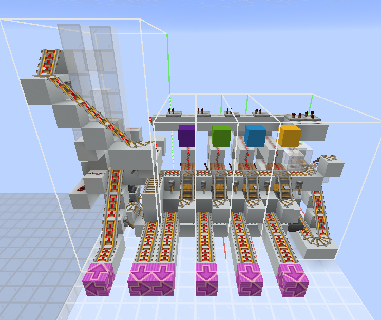

<!-- Insert here the name of your Router -->
# IcoTRS Cart Router

## Description

This router is a cheap and simple design for early-game or simple networks, based on chest minecarts and rails. The design has a tilable Output Port design,
meaning that the design can adapt to any amount of Output Ports. A router with 1 input, and 5 output ports (4 route-mapped ones, 1 default) perfectly fits within a minecraft Chunk (16x16 area).

---

## Specifications

> **Note**: *Physical* Input Ports refer to the amount of physical input Link connections the router has. The number of *Logical* ports for a Router is **1**, unless specified.

<!--
If the Router has more that one logical input port, for example, if it's capable of source-port-based routing (discussed in router_specs.md), add the following entry below the "Physical Ports (I/O)":
| Logical Ports (I/O)   | #in_p
>

<!-- 
Conventionally, N represents the number of ports for scalable designs that can be expanded to any number of ports.  
It can be used in formulas below (for example in footprint expression).
Uncomment the line below if your are using N.  
> `N` represents the number of Output Ports. 
-->

<!--
Package Technology must reference an existing specification file
located under implementations/Packages.

Do NOT write a free-text name only.
Always link to the corresponding spec file of the implementation.

If the technology you are using does not yet exist in
implementations/Packages, create and document the new Package
Technology there first, then reference it here.
-->

|  Specification   | Value |
|----------------------|-------|
| Design Version    | 1.0
| Minecraft Version     | Java 1.21.11 
| Component Class       | [RDS Router](/docs/router_specs.md) 
| Package Technology    | [ChestMinecart](/implementations/Packages/ChestMinecart/specs.md)
| Protocol              | [Standard RDS Protocol](/docs/rds_protocols.md#the-standard-rds-protocol)
| Physical Ports (I/O)  | 1 -> N
| Footprint (Area)      | 9×(6 + 2N)
| Height                | 13
| Works in Nether       | Yes
| Chunkloading Included | No 
| Package Queue Included        | Yes
| Empty Package Safe    | No 
| Throughput            | ~9 Pkg/min (~6.6s/Pkg) *
| Survival-friendliness  | High

---

## Notes

#### Timing Circuit configuration

This design relies on precise preconfigured timing to work properly, provided by pulse extender circuit on the top-right. Its job is to provide a signal from the moment it gets triggered until the Package/chest-minecart has left the router. The next minecart is let in from the queue only when the circuit fully discharges, meaning that the throughput of the Router is uniquely dependant on this parameter (\*).   
Depeding on the number of output ports, a different discharge time of the pulse extender is required for optimal operation. The rule is to add/remove 4 ticks (0.2s) of discharge time for each added/removed port from the standard 5 ports design. This can be achieved in various ways, by slightly modifying the pulse extender circuit.

...more...

---

Although the design can support up to N ports, the Router must have a bare minimum of two ports:
- One default port (the direction minecarts are forwarded if no match is found in the routing table)
- One routable port (has a routing map associated)

This means that this Router will always occupy at least a 9x10 area if used in its minimal 2-ports form. Having less than these ports makes it effectively no longer a Router.

---

As mentioned in the spec table, the router has a built-in minecart queue 
(taken from [CobblestoneAndDirt](https://www.youtube.com/watch?v=JQtGXKXlWMQ)), which works by stacking minecarts on top of each other and releasing them one by one, allowing Packages arriving close to each other to be processed sequentially one at a time. The default queue size is 7, but it can be made bigger or lower by raising/shortening the hole in which minecarts fall in and stack up.  
The whole rail system bringing minecarts up the hole can also be easily adapted based on specific needs.

---

Output Ports are return-safe, meaning that if something were to happen at the Link level causing minecarts to go back towards the Router in the output rail, minecarts will be sent back out.
