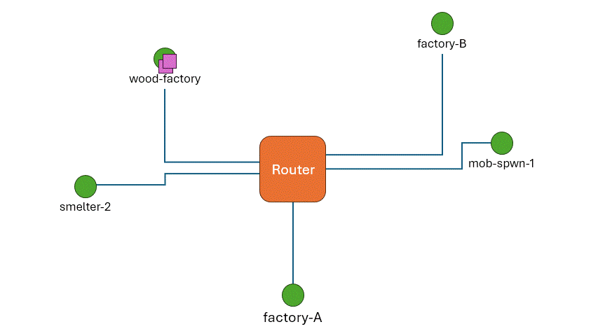

# The Minecraft Industrial Web Framework  

## Overview  

The MC Industrial Web Framework is a set of architectural principles, protocols, and ideas aimed at providing a structured and organized way to create an efficient and fully automated network of factories in vanilla Minecraft. It defines standardized methods for how factories located across the world can share resources on demand, fully automatically, by implementing common architectural patterns such as service–client and point-to-point resource transfer.  

The backbone of the framework is the **Resource Distribution System (RDS)**, a layered system designed for automated and efficient point-to-point resource sharing, inspired by the structure and behavior of real-world Internet networks. The goal of the RDS is to automate the delivery of a payload from a generic point A to point B in the world, based on a destination tag attached directly to the payload itself.  

## Core Entities of the Resource Distribution System (RDS)  

### 📬 Terminal  

A **Terminal** is an endpoint of the Resource Distribution System (RDS). It is a location where resources can either enter or exit the network. A *resource* is any quantity of items that we want to transfer from one Terminal to another.  

Resources are bundled into **Packages**, which are the physical units that travel across the network. In the current vision of the RDS, Packages are always Shulker Boxes. Therefore, the only objects that physically move through the network are Shulker Boxes containing the desired items as payload.  

The first slot (upper-left slot) of the Shulker Box is reserved for the **Destination Tag**. The Destination Tag is a (generally renamed) item encoding the unique identifier (address) of the destination Terminal. Routers use this tag to correctly forward the Package to its intended destination. All remaining slots are available for the payload, and are used for the actual resources transportation.  

### 🔀 Router  

A **Router** is the second core element of the RDS. It is directly inspired by Internet routers and follows the same operational principles.  

A Router is a node in the network where multiple edges meet and where traveling Packages are redirected based on their attached Destination Tag. A Router has exactly **one inbound port**, where all incoming Packages arrive (a router does not make distinctions regarding the Package's origin).  

A Router can have any number of outbound edges. Each outbound edge corresponds to an **Outbound Port**, which is simply a container used as a temporary buffer for Packages after a routing decision has been made.  

To perform routing decisions, a Router stores a **Routing Table** that maps each known destination address to a specific Outbound Port. When a Package arrives:  

1. The Router extracts the Destination Tag from the first slot of the Shulker Box.  
2. The Routing Table is checked for a matching destination address.  
3. The Destination Tag is reinserted into the same slot.  
4. If a matching Outbound Port exists, the Package is moved to that port.  

If no mapping is found, the behavior is implementation-defined (for example: forwarding to a fallback port or storing the Package for manual inspection).  

It is important to clarify that **Routers do not perform physical transportation**. They only move Packages from the Inbound Port to one of the Outbound Ports. The physical movement between nodes is handled entirely by the Transport Layer.  

Although conceptually different, a Router and a Terminal can physically coexist in the same structure. A single build may act as both a Router and a Terminal simultaneously.  

> Most of what has been said about routers so far can also be found, in more detail, in the *router_specs.md* file.

### 🚚 Transport Layer  

The **Transport Layer** consists of any Minecraft technology capable of moving items from one point to another.  

Within the RDS, the Transport Layer is responsible for physically moving Packages between:  

- Terminal → Router  
- Router → Router  
- Router → Terminal  

A complete route from source Terminal to destination Terminal consists of multiple **Hops**, each performed by the Transport Layer.  

Several Minecraft technologies can fulfill this role, each with advantages and disadvantages. The choice depends on the specific design requirements. Examples include:  

- Flowing water conveyor systems  
- Minecart with Chest on rails  

Since Routers and Terminals are transport-agnostic, different technologies can be combined across different Hops of the same route, depending on constrains or conveniences dictated by enviromental or external factors. 

## Example: A Package Journey Through the RDS  

Suppose we want to transfer a large quantity of oak logs from the Oak Farm to the Industrial Smelter.  

1. A Destination Tag is created by renaming an item with the unique identifier of the Industrial Smelter (for example: `"smelter-2"`).  
2. The Destination Tag is placed in the first slot of a Shulker Box.  
3. The remaining slots are filled with oak logs.  

Once prepared, the Package is handed to the origin Terminal. The Terminal passes it to the Transport Layer, which moves it to the nearest Router.  

At the Router:  

- The Package enters the Inbound Port.  
- It may wait be queued in a buffer if other Packages are already being processed. 
- The Router processes the Destination Tag and forwards the Package to the correct Outbound Port.  

Once in the Outbound Port, it's now the job of the Transport Layer to perform the next Hop. Depending on the network structure, the Package may reach another Router (where the same process repeats) or directly reach the destination Terminal.  

Finally, when the Package arrives at `"smelter-2"`, the Transport Layer deposits it into the Terminal’s receiving container, where the contents can be accessed by players or machines.  

  
  
<em>Visual representation of Packages traveling through a RDS network</em>

## Implementing full industrial automation using the RDS

We have seen how the RDS can dynamically move a Package full of resources from a generic point A to a point B in a Minecraft world. In theory, this system could already be used directly by players to assist with resource transportation. In practice, however, there are faster manual methods for moving large quantities of items, such as Elytra flight with rockets.  

However, since the RDS is fully automatic, it can be used to interconnect any number of factories into a unified, fully automatic industrial network. Factories can exchange resources dynamically, even across very large distances. More importantly, the RDS provides a standardized, interconnected, web-like transportation infrastructure capable of satisfying all dependency relationships between factories.

For example, if Factory A and Factory B both depend on the output of Factory C, the RDS already enables items to flow from C to A and from C to B without requiring two separate, specialized transport lines. Similarly, if Factory C depends on the products of Factory E and Factory F, the same infrastructure naturally supports resource delivery from E and F back to C.  

It becomes clear how such an approach can support large-scale industrial automation projects.

### Service–Client Pattern

The Service–Client pattern applies whenever one entity provides a service and multiple clients may request it. In general terms, a client sends a request to a service provider, and the provider responds with the requested material or action.

Within the RDS context, for example, this pattern can be especially useful for factories that require periodic resource refills. Consider a Cake Factory. To continuously produce cakes, it must maintain internal storage for eggs, wheat, sugar, and milk. In an automated setup, whenever one of these resources drops below a certain threshold, the Cake Factory should be able to request a refill from the corresponding production farms (Egg Farm, Wheat Farm, and so on).

Using the RDS, this interaction can be implemented by exchanging two Packages:

- A **Request Package**, containing only information.
- A **Response Package**, containing the requested resources.

For a basic material request, the Request Package must include two essential pieces of information:

- **Source Address** – the address from which the request originates; in other words, where the response must be sent (typically the client’s own address).
- **Request Type** – the kind of action being requested.

These can be encoded as renamed items placed in the second and third slots of the Shulker Box (with the first slot reserved for the Destination Tag). The remaining slots are typically left empty for a Request Package.

On the service provider’s side, additional redstone logic is required to automatically parse the request, execute the appropriate action, construct a Response Package, and send it back to the specified Source Address. The exact technical implementation may vary, and could eventually be standardized, but strict standardization is not required as long as the provider respects the described protocol above.

Returning to the Cake Factory example:  
The Source Address could be stored as a ready-to-use Destination Tag named `"cake-fact"`, while the Request Type might be encoded as `"EGG-REFILL-qt10"` somehow indicating a refill request of 10 stacks of eggs. The Egg Farm, upon receiving this Request Package, prepares a Response Package containing the requested eggs and uses the provided `"cake-fact"` Destination Tag as the address used for the Response Package.

### ...Some more ideas:

#### Centralized Storage

Instead of having resources move directly between factories, a large centralized storage facility could be built — essentially a massive item sorter and warehouse. All produced resources would automatically be sent there through the RDS.  

In this model, factories would not contact individual production sites for refills. Instead, they would simply send requests to the central storage system, which would act as a universal provider. This approach could simplify dependency and centralizes inventory management.

#### Usage of the Nether

The entire RDS infrastructure could be constructed on the Nether roof. Because the Nether-to-Overworld distance ratio is 1:8, long-distance transportation becomes significantly faster in effective Overworld terms.  

However, it has to be noted that some transport tecnhologies might be unvaiablable in the nether, such as water conveyor systems.

## State of Tech

At the current stage, both the RDS *Router* and *Terminal* have functional redstone implementations, although it might not be an absolutely optimal design in terms of speed or throughput.

In its current form, each Router can differentiate up to **54 distinct destinations per Outbound Port**. If more destinations are required, multiple Ports can be wired to the same underlying Transport connection. Each additional Port increases the Router’s length by 2 blocks, making the design 2-block tileable.  

The base processing time per Package is slightly above 5 seconds, and it increases linearly by approximately 0.5 seconds for each added Outbound Port.

Terminals currently provide no real abstraction over the underlying Transport Layer. They simply expose input and output points where Packages can be inserted into or extracted from the network. In testing, only water conveyor systems have been used, meaning that Terminals effectively function just as controlled drop-off and pickup points for Shulker Boxes.

At the moment, there is no complete redstone implementation of the Service–Client pattern.